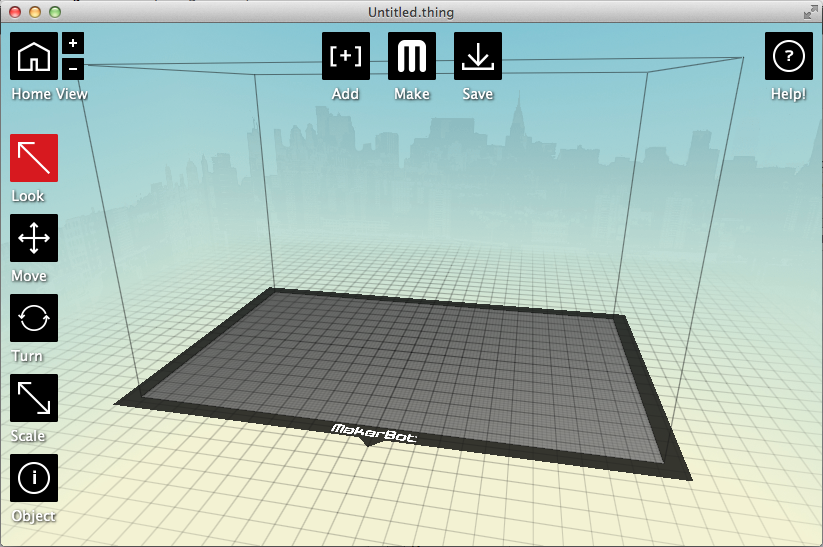
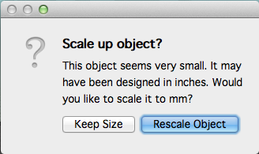
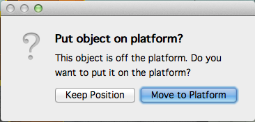
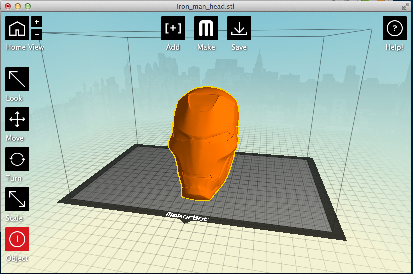
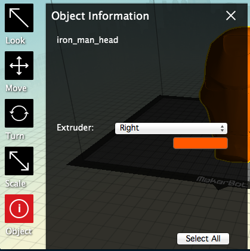
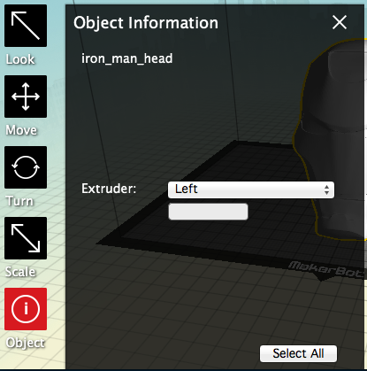
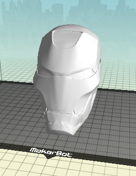
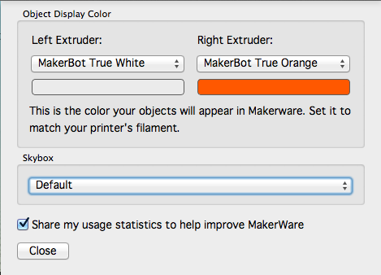
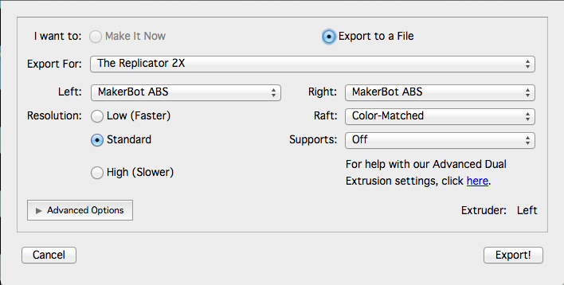

# Utilisation de MakerWare

## Pourquoi

L'impression sur la Replicator 2X est possible pour l'instant que sur l'extrudeur de gauche.
Principal problème, l'extrudeur par défaut est celui de droite. Tu vas voir comment changer ça.

## Comment

Ouvrir MakerWare

Clique sur "Add" puis charge ton fichier 3D.

Le logiciel va te proposer de redimensionner le fichier.

Et maintenant de le "poser" sur la plateforme. C'est plutôt conseillé de répondre oui à cette question.

Ton modèle 3D est importé.

Sélectionner le modèle en cliquant dessus

Les objets sélectionnés sont entourés de jaune.

Clique sur "Object" et change d'extrudeur.

Ferme avec la croix.

Tu vois que le changement est pris en compte.

Si les couleurs des extrudeurs gauche et droite ne correspondent pas. Il faut aller dans les préférences.

Dernière étape, prépare le modèle pour le mettre sur la carte SD. Clique sur Make et valide tout ça une fois que les paramètres sont bien réglés.

Met le fichier sur la carte SD avant de la mettre dans l'imprimante.

Enjoy.